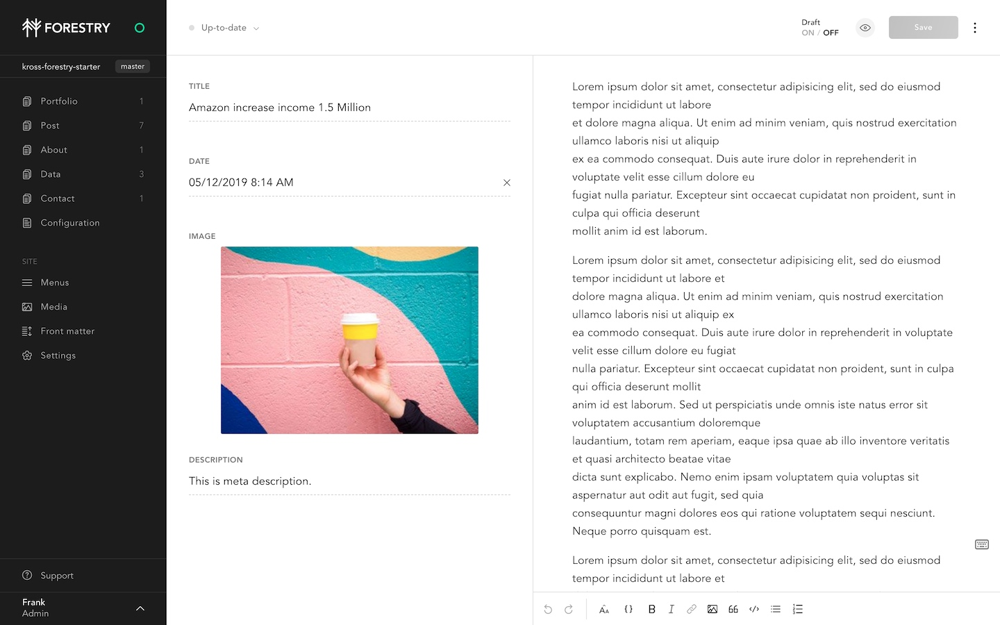

# Kross Hugo Portfolio Forestry starter


[Live Preview](http://demo.themefisher.com/kross-hugo/)

[Kross Hugo theme](https://github.com/themefisher/kross-hugo/) is developed by Themefisher.

## Requirements

- GitHub, GitLab or BitBucket account
- Hugo > 0.58.2 (tested with latest Hugo)

## Content Management



[](https://app.forestry.io/quick-start?repo=forestryio/kross-hugo-starter&engine=hugo&version=0.75.1)

This project has been pre-configured to work with [Forestry](https://forestry.io) a git-based CMS, [import your repository in Forestry](https://app.forestry.io/quick-start?repo=forestryio/kross-hugo-starter&engine=hugo&version=0.75.1) and you'll be able to edit and preview your site ✨. \

Any changes you make in Forestry will be commited back to the repo, and deployed when your Git repository is connected to [Netlify](#netlify).

## Deployment

### Netlify

[](https://app.netlify.com/start/deploy?repository=https://github.com/forestryio/kross-hugo-starter)

1. Set the build command to: `hugo --gc --minify`
2. Set the publish directory to: `public`
3. Make sure to set `HUGO_VERSION` to 0.58.2 or above (tested with 0.75.1)
3. Set the publish directory to: `public`

That's it, now your site gets deployed automatically on `git push` or when saving documents from Forestry.

## Local development

This starter is using [Hugo](https://gohugo.io) as a static site generator.
Once imported in Forestry, clone your repository and develop locally with Hugo.

```bash
# Clone your repository
# Go in the project directory
# Start local dev server
hugo server
```

## Feedback

[Open an issue](https://github.com/themefisher/kross-hugo/issues) in the theme's repository.

## LICENSE

[MIT](https://github.com/themefisher/kross-hugo/blob/master/LICENSE)
